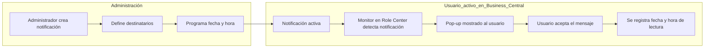
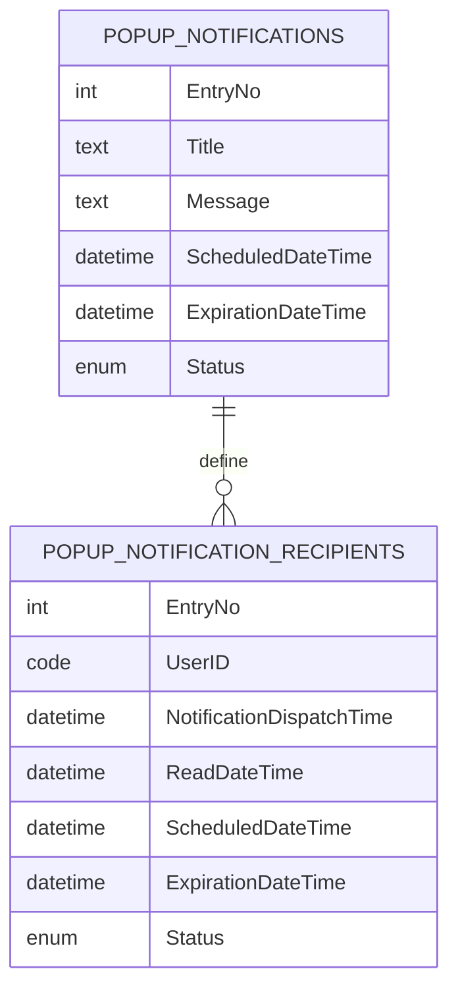
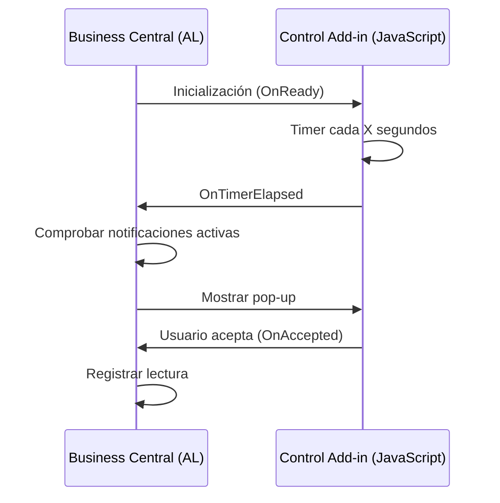

# Real‑Time Pop‑up Notification System

**Derechos de autor y nota de atribución**

Esta solución se basa en la original "*Alertas en tiempo real para BC: Sistema de notificaciones emergentes para usuarios activos*" del autor [**Gerardo Rentería**](https://gerardorenteria.blog/), publicada en su repositorio de [**GitHub**](https://github.com/gdrgdev/Blog/tree/main/GDRGDev_PopupNotifications).

El código original se utiliza como **inspiración técnica**, habiendo sido posteriormente **modificado, ampliado y adaptado** para cumplir requisitos funcionales, técnicos y de gobernanza propios. La presente documentación y las extensiones descritas no representan una reproducción literal del código original, sino una evolución funcional basada en dicha referencia.

## Tabla de contenidos

- [Real‑Time Pop‑up Notification System](#realtime-popup-notification-system)
  - [Tabla de contenidos](#tabla-de-contenidos)
- [Real‑Time Pop‑up Notification System](#realtime-popup-notification-system-1)
  - [Resumen ejecutivo](#resumen-ejecutivo)
  - [Introducción](#introducción)
  - [Objetivo de la solución](#objetivo-de-la-solución)
  - [Guía funcional (para usuarios)](#guía-funcional-para-usuarios)
    - [Diagrama conceptual del flujo funcional](#diagrama-conceptual-del-flujo-funcional)
    - [Configuración](#configuración)
      - [Conf. notificaciones emergentes](#conf-notificaciones-emergentes)
      - [Categoría de notificaciones](#categoría-de-notificaciones)
    - [Creación de una notificación](#creación-de-una-notificación)
    - [Selección de destinatarios](#selección-de-destinatarios)
    - [Programación y envío](#programación-y-envío)
    - [Información del sistema](#información-del-sistema)
    - [Vista previa de la notificación](#vista-previa-de-la-notificación)
    - [Notificaciones activas](#notificaciones-activas)
    - [Historial de destinatarios de notificaciones emergentes](#historial-de-destinatarios-de-notificaciones-emergentes)
    - [Cues y KPIs](#cues-y-kpis)
  - [Descripción funcional de las páginas](#descripción-funcional-de-las-páginas)
    - [Pop‑up Notification List](#popup-notification-list)
    - [Pop‑up Notification Card](#popup-notification-card)
    - [Pop‑up Notification Recipients](#popup-notification-recipients)
    - [Pop‑up Notification Monitor](#popup-notification-monitor)
  - [Manual técnico](#manual-técnico)
    - [Modelo de datos](#modelo-de-datos)
      - [Diagrama conceptual del modelo de datos](#diagrama-conceptual-del-modelo-de-datos)
    - [Pages](#pages)
    - [Control Add‑in](#control-addin)
      - [Diagrama de arquitectura del Control Add‑in](#diagrama-de-arquitectura-del-control-addin)
    - [Codeunits](#codeunits)
      - [Pop‑up Notification Mgt](#popup-notification-mgt)
      - [Cue Background Task](#cue-background-task)
      - [5.4.3 Pop‑up Notif. Cleanup Job](#543-popup-notif-cleanup-job)
  - [Cómo extender Role Centers](#cómo-extender-role-centers)
    - [Ejemplo para Role Center personalizado](#ejemplo-para-role-center-personalizado)

# Real‑Time Pop‑up Notification System

## Resumen ejecutivo

El **Real-Time Pop-up Notification System** es una solución corporativa para Microsoft Business Central que permite **comunicar mensajes críticos en tiempo real**, asegurando su visualización por los usuarios y proporcionando métricas claras de impacto. La solución está orientada a organizaciones que necesitan:

- Garantizar que ciertos mensajes sean vistos (IT, finanzas, seguridad, operativa).
- Auditar la lectura por usuario.
- Evitar la dependencia del correo electrónico.
- Integrarse de forma nativa en el Role Center.

El sistema es **robusto, extensible y alineado con las mejores prácticas de Business Central**, y puede adaptarse tanto a Role Centers estándar como personalizados.

## Introducción

El **Real‑Time Pop‑up Notification System** es una solución diseñada para **comunicar mensajes críticos en tiempo real** a los usuarios de Microsoft Business Central, directamente dentro de la aplicación y sin depender de correos electrónicos, workflows o revisiones manuales.

A diferencia de otros mecanismos de notificación, este sistema:

- Muestra **pop‑ups modales** mientras el usuario trabaja en Business Central.
- Garantiza que **cada usuario ve cada notificación como máximo una vez**.
- Permite **programar fechas de activación y caducidad**.
- Registra **quién ha leído cada notificación y cuándo**.
- Proporciona **KPIs y cues** para medir el impacto de cada envío.

La solución está pensada para entornos empresariales donde es crítico asegurar que ciertos mensajes (IT, finanzas, operativa, seguridad, etc.) llegan efectivamente a los usuarios.

## Objetivo de la solución

Los objetivos principales son:

- Proporcionar un **canal de comunicación inmediato y fiable**.
- Evitar la dependencia del correo electrónico o de acciones manuales del usuario.
- Permitir a los administradores **auditar la lectura** de los mensajes.
- Integrarse de forma **natural** en la experiencia estándar de Business Central.
- Ser **extensible** a Role Centers estándar y personalizados.


## Guía funcional (para usuarios)

### Diagrama conceptual del flujo funcional
Este diagrama resume el ciclo completo de vida de una notificación, desde su creación hasta la confirmación de lectura por parte del usuario final.


### Configuración

> **Nota**
>
> La solución utiliza un Control Add-in ubicado en el Role Center de cada usuario. Por defecto, la solución ubica este componente en el Role Center "Administrador empresarial" (*Business Manager*). Si el administrador quiere notificar a usuarios con perfiles (roles) distintos a este, deberá personalizar la solución añadiendo una PageExt que extienda el Role Center que desee. Para más información, ver el punto [*Cómo extender Role Centers*](#cómo-extender-role-centers).

#### Conf. notificaciones emergentes
Esta página el administrador puede automatizar la actualización del estado de las notificaciones. Para esto, puede habilitar una cola de trabajo que recorre todas las notificaciones, ver cuáles han expirado y no han sido enviadas, para modificar su estado a "Cancelado". 

En la sección "Configuración (Job inactivo)" el administrador podrá definir:
- Una **Descripción" de la cola de trabajo
- Una categoría en **Cód. categoría cola trabajos"
- Prioridad (dentro de la misma categoría) que por defecto se inicializa a "Baja"
- Minutos entre ejecuciones que por defecto se inicializa a 5 minutos

El usuario además, pude configurar un correo electrónico de contacto.


La primera vez que el usuario habilita (acción "Habilitar") la cola de trabajo, el sistema crea una nueva cola con los parámetros definidos. El usuario puede deshabilitarla (acción "Deshabilitar") o modificar cualquiera de estos parámetros con la opción "Aplicar configuración". Esta última acción, deshabilita temporalmente la cola de trabajo para modificar los parámetros y deja la cola al estado original antes de aplicar los cambios.


Una vez habilitada, la sección de Configuración se actualiza con los valores actuales de la cola de trabajo.
#### Categoría de notificaciones
El administrador puede categorizar las notificaciones en la página "Códigos categoría de notificación".


### Creación de una notificación

Las notificaciones se crean desde la **lista de Notificaciones emergentes**. Cada notificación representa un mensaje único que será enviado a un conjunto de usuarios.

El usuario administrador debe introducir:

- **Título**: título de la notificación.
- **Mensaje**: cuerpo completo que se mostrará en el pop‑up.
- **Categoría** (opcional): permite clasificar notificaciones. 

Por defecto, una notificación se crea en estado **Abierto**, lo que permite modificarla y añadir destinatarios.


Se asigna el usuario que crea o modifica la notificación como responsable.

Las acciones:

- **Lanzar**: permite lanzar la notificación para que se programe su ejecución.
- **Volver a abrir**: permite abrir de nuevo la configuración de la notificación para su modificación.
- **Cancelar**: permite cancelar la programación.

### Selección de destinatarios
Desde la ficha de la notificación, el administrador puede **seleccionar manualmente los usuarios** que deben recibir el mensaje a través de la acción "Seleccionar destinatarios".


El sistema crea un registro independiente por cada usuario, lo que permite:

- Controlar el estado individual (pendiente, leída, cancelada).
- Registrar la fecha exacta de lectura.
- Calcular métricas de impacto.

Los usuarios seleccionados se añaden en la sección "Destinatarios".

### Programación y envío

Una notificación debe configurarse con:

- **Fecha/Hora programada**: momento a partir del cual el pop‑up puede mostrarse.
- **Fecha de caducidad**: a partir de este momento la notificación deja de ser válida.

Al lanzar la notificación:

- El estado pasa a **Programado** y en este momento se actualiza tanto el estado como las fechas programada y de caducidad para cada usuario con los valores de la cabecera.
- Los destinatarios quedan preparados para recibir el mensaje cuando se cumpla la fecha.
- La notificación queda en un estado no editable (será necesario abrirla de nuevo)

### Información del sistema
En la sección "Información del sistema" se muestra los usuarios que crearon y/o modificaron la notificación así como su fecha y hora.

### Vista previa de la notificación
En cualquier momento, el administrador puede lanzar una vista previa de la notificación con la acción "Vista previa".


### Notificaciones activas

Cuando un usuario tiene una notificación activa:

- El sistema detecta automáticamente la notificación en segundo plano.
- Aparece un **pop‑up modal centrado** sobre la interfaz en el momento que el usuario accede al Role Center. El sistema queda bloqueado hasta que el usuario confirma su lectura con el selector de "Aceptar".
  

  > **Importante**
  >
  > La notificación sólo se muestra al usuario cuando este accede a la página de su Role Center.

- El usuario debe pulsar **Aceptar** para continuar. En ese momento:
  - Se registra la fecha/hora de lectura y se cambia el estado de la notificación a nivel de usuario a "Leído". La fecha "emisión" refleja el *datetime* en el que el usuario ha accedido a su Role Center y por lo tanto, se ha activado su notificación. Aquellos usuarios que no han accedido aún a su Role Center siguen con un estado "Programado" para su ejecución hasta la fecha de expiración configurada.
  - La notificación no vuelve a mostrarse a ese usuario.
  
  

### Historial de destinatarios de notificaciones emergentes
La página "**Historial de destinatarios de notificaciones emergentes**" contiene las líneas de notificaciones a nivel de usuarios destinatarios, con la información de su estado, fecha y hora programada, de emisión y caducidad y el momento en que el usuario ha confirmado su lectura.


### Cues y KPIs

En el Role Center, el usuario puede ver indicadores como:

- **Notificaciones programadas para mí**, que contiene todas las notificaciones programadas
- **Porcentaje de mensajes leídos en el último envío**, que identifica la cantidad de notificaciones leídas vs. el total

Estos indicadores permiten tanto a usuarios como a administradores entender el estado de las comunicaciones.

## Descripción funcional de las páginas

### Pop‑up Notification List
Página de lista que muestra todas las notificaciones creadas, su estado, categoría y métricas agregadas (destinatarios totales y lecturas).

### Pop‑up Notification Card
Ficha principal de mantenimiento de la notificación. Desde aquí se:
- Edita el contenido.
- Programan fechas.
- Gestionan destinatarios.
- Lanza, reabre o cancela la notificación.

### Pop‑up Notification Recipients
Lista histórica por usuario que permite:
- Ver quién ha recibido la notificación.
- Consultar fechas de envío y lectura.
- Acceder directamente a la notificación original.

### Pop‑up Notification Monitor
Página tipo **CardPart** que no está pensada para interacción directa, sino para:
- Cargar el **Control Add‑in**.
- Ejecutar comprobaciones periódicas.
- Mostrar KPIs en el Role Center.

Es un componente clave para el funcionamiento en tiempo real.

## Manual técnico
### Modelo de datos
#### Diagrama conceptual del modelo de datos



El diseño separa claramente la definición del mensaje (cabecera) del estado individual por usuario (destinatarios), lo que permite auditoría completa y métricas fiables.
El sistema se basa en un diseño clásico de **cabecera + detalle**:

- **Pop‑up Notifications**: define el mensaje y su ciclo de vida.
- **Pop‑up Notification Recipients**: define el estado de cada usuario.

Esta separación permite una auditoría completa y cálculos eficientes.

### Pages

Las páginas siguen el patrón estándar de Business Central:

- List + Card para mantenimiento.
- ListPart para gestión de destinatarios.
- CardPart para lógica en segundo plano.

### Control Add‑in

#### Diagrama de arquitectura del Control Add‑in



Este diagrama muestra cómo AL y JavaScript colaboran para ofrecer notificaciones en tiempo real sin bloquear la interfaz del usuario.

El Control Add‑in es necesario porque Business Central no ofrece:

- Timers nativos en AL.
- Modales UI persistentes.

El add‑in implementa:

- Un **timer JavaScript**.
- Un modal HTML/CSS.
- Comunicación bidireccional AL ↔ JavaScript.

Eventos clave:

- `OnReady`: inicialización.
- `OnTimerElapsed`: comprobación periódica.
- `OnAccepted`: confirmación del usuario.


### Codeunits

#### Pop‑up Notification Mgt

Es el **núcleo funcional** del sistema.

Responsabilidades:

- Validaciones funcionales.
- Gestión de destinatarios.
- Resolución de notificaciones activas.
- Registro de lecturas.
- Integración con Job Queue para limpieza.

Cada procedure encapsula una responsabilidad clara, evitando lógica en páginas.

#### Cue Background Task

Este codeunit permite calcular KPIs **en segundo plano**, evitando bloquear el Role Center.

Utiliza Background Tasks para:

- Calcular notificaciones pendientes por usuario.
- Calcular porcentajes de lectura.

Los resultados se devuelven a la página mediante `Page.SetBackgroundTaskResult`.

#### 5.4.3 Pop‑up Notif. Cleanup Job

Job ejecutado periódicamente para:

- Cancelar notificaciones caducadas.
- Mantener el sistema limpio.

## Cómo extender Role Centers

La solución **no depende de un Role Center concreto**.

El monitor se añade mediante una **pageextension**, por lo que:

- Funciona en Role Centers estándar.
- Puede añadirse a Role Centers personalizados.

### Ejemplo para Role Center personalizado

```al
pageextension 70000 "My RC Popup Monitor" extends "My Custom Role Center"
{
    layout
    {
        addlast(RoleCenter)
        {
            part(PopupMonitor; "Pop-up Notification Monitor")
            {
                ApplicationArea = All;
            }
        }
    }
}
```

Esta arquitectura permite que partners o clientes integren la solución sin modificar el core.